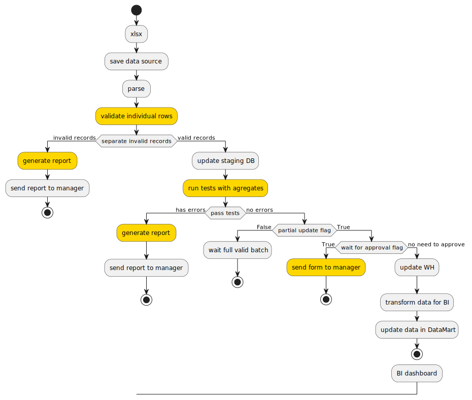
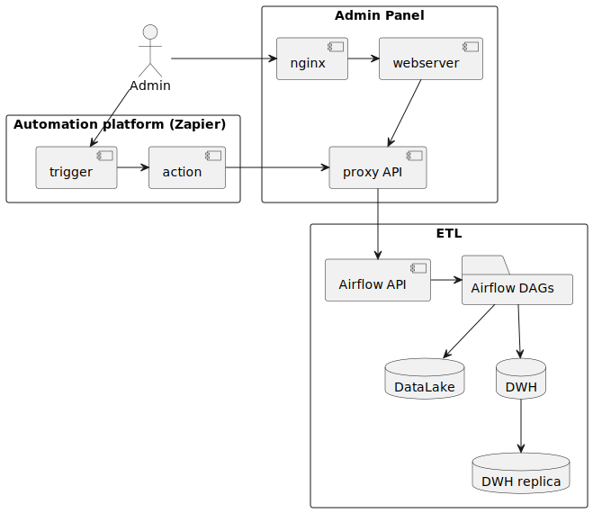
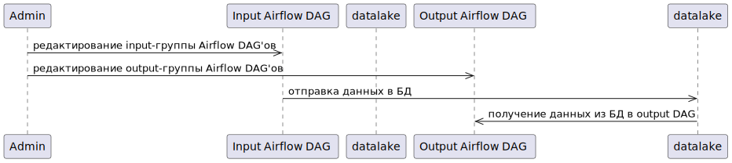

# ETL
Если коротко описать наш проект, то это простой и удобный для пользователя web-интерфейс для создания, запуска и мониторинга ETL-пайплайнов.

Основная функциональность:
- создание и редактирование пайплайнов обработки данных
- API для взаимодействия с интеграционными платформами (Zapier, n8n, make и подобные)

## Требования
### Функциональные
1. Запустить обработку ETL.
2. Остановить обработку ETL. При этом нужно обработать оставшиеся записи.
3. Обновить настройки ETL-скрипта. Сюда входит любая метаинформация: название таблицы, какие поля доставать, какие события обрабатывать и другие настройки.
### Нефункциональные
- не должно быть единой точки отказа
### Дополнительные
## Оценка ограничений и пропускной способности
### Трафик
### Хранилище
### Память
### Пропускная способность
### CPU
## Проектирование API
## Проектирование уровня хранения данных, схема, партицирование
## Схема
## Базовый алгоритм и архитектура

*пример процесса загрузки данных из файла в целевую базу данных*

*архитектура*

## Масштабирование
## Кэширование
## Диаграмма вариантов использования
## Диаграмма классов
## Диаграмма активностей
## Диаграмма последовательности

## Страницы фронтенда
## Дополнительная информация
### Альтернативые реализации
### Библиотеки
### Конференции
### Документация
- [Airflow](https://airflow.apache.org/docs/apache-airflow/stable/index.html)
- [Airflow REST API](https://airflow.apache.org/docs/apache-airflow/stable/stable-rest-api-ref.html#section/Overview)
- [dbt](https://docs.getdbt.com/docs/introduction)
